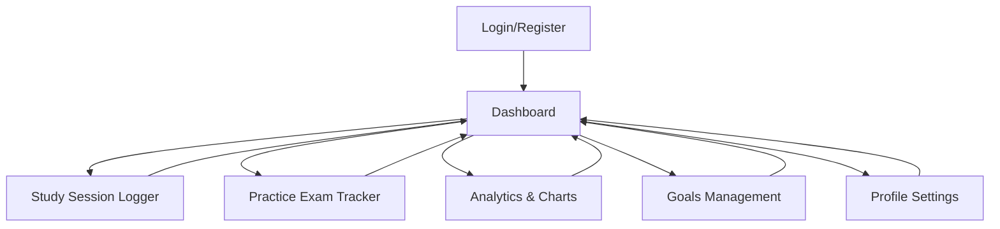

# MCAT Study Tracker - Product Requirements Document

## 1. Product Overview
A cross-platform mobile application designed to help MCAT students track their study progress, log practice sessions, and monitor performance through interactive analytics.

The app addresses the challenge of maintaining consistent study habits and tracking progress across different MCAT subjects, providing students with data-driven insights to optimize their preparation strategy.

## 2. Core Features

### 2.1 User Roles
| Role | Registration Method | Core Permissions |
|------|---------------------|------------------|
| Student | Email/password registration via Supabase Auth | Can log study sessions, track progress, set goals, view personal analytics |

### 2.2 Feature Module
Our MCAT Study Tracker consists of the following main pages:
1. **Authentication Pages**: login, registration, password reset functionality.
2. **Dashboard**: overview of recent activity, progress summary, quick actions.
3. **Study Session Logger**: session recording, subject selection, time tracking.
4. **Practice Exam Tracker**: exam results logging, score tracking, performance analysis.
5. **Analytics & Charts**: interactive performance visualizations, progress trends.
6. **Goals Management**: goal setting, progress tracking, milestone achievements.
7. **Profile Settings**: user preferences, account management, data export.

### 2.3 Page Details
| Page Name | Module Name | Feature description |
|-----------|-------------|---------------------|
| Login Page | Authentication | Email/password login, forgot password link, registration redirect |
| Registration Page | User Signup | Email/password registration, terms acceptance, email verification |
| Dashboard | Overview Panel | Display recent study sessions, weekly progress summary, upcoming goals |
| Dashboard | Quick Actions | Start new study session, log practice exam, view today's progress |
| Study Logger | Session Recording | Start/stop timer, select MCAT subjects, add notes, save session data |
| Study Logger | Subject Selection | Choose from MCAT categories (Biology, Chemistry, Physics, Psychology, etc.) |
| Practice Exam | Exam Entry | Log practice test scores, select test type, record completion time |
| Practice Exam | Score Analysis | Compare scores over time, identify weak areas, track improvement |
| Analytics | Performance Charts | Interactive line charts showing progress trends, subject-wise performance |
| Analytics | Statistics Dashboard | Total study hours, average scores, streak counters, weekly summaries |
| Goals | Goal Setting | Create MCAT score targets, study hour goals, subject-specific objectives |
| Goals | Progress Tracking | Visual progress bars, milestone celebrations, deadline reminders |
| Profile | Account Settings | Update personal information, change password, notification preferences |
| Profile | Data Management | Export study data, reset progress, account deletion options |

## 3. Core Process
**Student Flow:**
1. User registers/logs in through Supabase authentication
2. Sets initial MCAT goals and target scores
3. Logs daily study sessions with subject selection and time tracking
4. Records practice exam results and scores
5. Views progress analytics and performance trends
6. Adjusts goals based on performance insights
7. Exports data for external analysis if needed

## 4. User Interface Design
### 4.1 Design Style
- **Primary Colors**: Deep blue (#1E40AF) for headers and primary actions, light blue (#3B82F6) for accents
- **Secondary Colors**: Green (#10B981) for success states, orange (#F59E0B) for warnings, red (#EF4444) for errors
- **Button Style**: Rounded corners (8px radius), elevated shadow for primary buttons, outlined style for secondary
- **Font**: System fonts (SF Pro on iOS, Roboto on Android), 16px base size, 14px for secondary text
- **Layout Style**: Card-based design with clean spacing, bottom tab navigation, floating action buttons
- **Icons**: Outline style icons from Expo Vector Icons, consistent 24px size for navigation

### 4.2 Page Design Overview
| Page Name | Module Name | UI Elements |
|-----------|-------------|-------------|
| Login Page | Authentication Form | Centered card layout, blue gradient background, white input fields with subtle borders |
| Dashboard | Overview Cards | Grid layout with rounded cards, progress rings, color-coded subject indicators |
| Study Logger | Timer Interface | Large circular timer display, subject chips, floating start/stop button |
| Practice Exam | Score Input | Number input with validation, dropdown for test types, progress indicators |
| Analytics | Chart Display | Full-width interactive charts, filter tabs, swipeable chart sections |
| Goals | Progress Bars | Animated progress bars, milestone badges, achievement celebrations |
| Profile | Settings List | Grouped list items, toggle switches, navigation arrows |

### 4.3 Responsiveness
Mobile-first design optimized for iOS and Android devices, with touch-friendly interface elements and gesture-based navigation. Supports both portrait and landscape orientations with adaptive layouts.