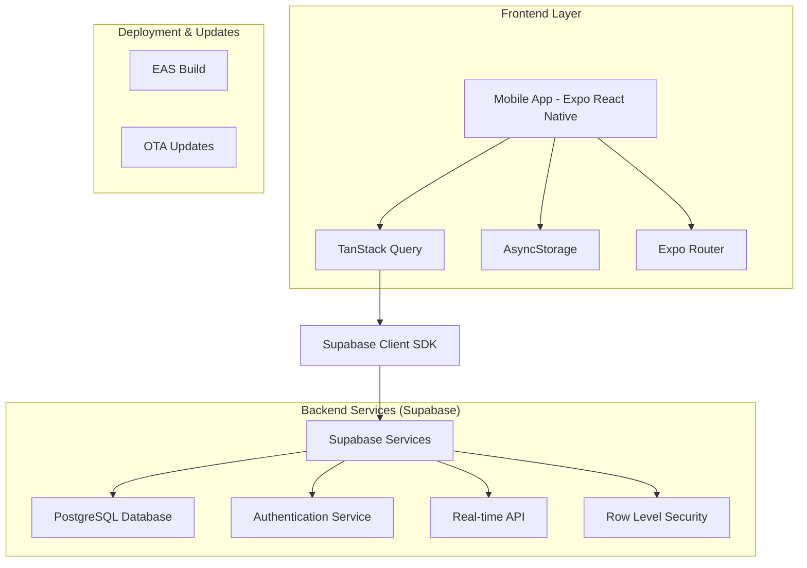
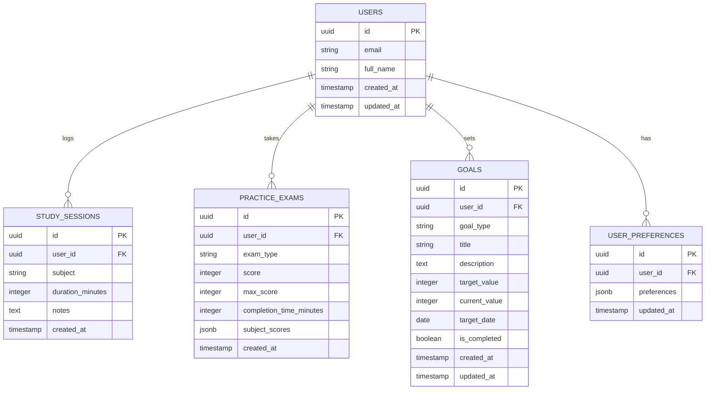

# MCAT Study Tracker - Technical Architecture Document

## 1. Architecture Design



## 2. Technology Description

* Frontend: React Native (Expo managed workflow) + TypeScript + TanStack Query + Expo Router

* Backend: Supabase (PostgreSQL, Auth, Real-time API)

* Local Storage: AsyncStorage for offline caching

* Charts: React Native Chart Kit or Victory Native

* Deployment: EAS Build + Over-the-Air (OTA) updates

## 3. Route Definitions

| Route                   | Purpose                                              |
| ----------------------- | ---------------------------------------------------- |
| /(auth)/login           | Login screen with email/password authentication      |
| /(auth)/register        | User registration with email verification            |
| /(auth)/forgot-password | Password reset functionality                         |
| /(tabs)/dashboard       | Main dashboard with study overview and quick actions |
| /(tabs)/study           | Study session logging and timer interface            |
| /(tabs)/exams           | Practice exam tracking and score logging             |
| /(tabs)/analytics       | Performance charts and progress visualization        |
| /(tabs)/goals           | Goal setting and progress tracking                   |
| /(tabs)/profile         | User profile and app settings                        |
| /study/session          | Active study session with timer                      |
| /exams/log              | Practice exam score entry form                       |
| /analytics/detailed     | Detailed analytics with filtering options            |

## 4. API Definitions

### 4.1 Core API

Authentication (handled by Supabase Auth)

```typescript
// Login
supabase.auth.signInWithPassword({
  email: string,
  password: string
})

// Register
supabase.auth.signUp({
  email: string,
  password: string,
  options: {
    data: {
      full_name: string
    }
  }
})
```

Study Sessions API

```typescript
// Create study session
POST /rest/v1/study_sessions
```

Request:

| Param Name        | Param Type | isRequired | Description                             |
| ----------------- | ---------- | ---------- | --------------------------------------- |
| user\_id          | uuid       | true       | User identifier                         |
| subject           | string     | true       | MCAT subject (Biology, Chemistry, etc.) |
| duration\_minutes | integer    | true       | Session duration in minutes             |
| notes             | text       | false      | Optional study notes                    |
| created\_at       | timestamp  | true       | Session timestamp                       |

Response:

| Param Name        | Param Type | Description           |
| ----------------- | ---------- | --------------------- |
| id                | uuid       | Session identifier    |
| user\_id          | uuid       | User identifier       |
| subject           | string     | Study subject         |
| duration\_minutes | integer    | Session duration      |
| created\_at       | timestamp  | Session creation time |

Practice Exams API

```typescript
// Log practice exam
POST /rest/v1/practice_exams
```

Request:

| Param Name                | Param Type | isRequired | Description            |
| ------------------------- | ---------- | ---------- | ---------------------- |
| user\_id                  | uuid       | true       | User identifier        |
| exam\_type                | string     | true       | Type of practice exam  |
| score                     | integer    | true       | Exam score             |
| max\_score                | integer    | true       | Maximum possible score |
| completion\_time\_minutes | integer    | false      | Time taken to complete |
| subject\_scores           | jsonb      | false      | Subject-wise breakdown |

## 5. Data Model

### 5.1 Data Model Definition



### 5.2 Data Definition Language

Users Table (handled by Supabase Auth)

```sql
-- Users table is automatically created by Supabase Auth
-- We'll extend it with a profiles table
CREATE TABLE profiles (
    id UUID REFERENCES auth.users(id) PRIMARY KEY,
    full_name TEXT,
    avatar_url TEXT,
    created_at TIMESTAMP WITH TIME ZONE DEFAULT NOW(),
    updated_at TIMESTAMP WITH TIME ZONE DEFAULT NOW()
);

-- Enable RLS
ALTER TABLE profiles ENABLE ROW LEVEL SECURITY;

-- Policies
CREATE POLICY "Users can view own profile" ON profiles
    FOR SELECT USING (auth.uid() = id);

CREATE POLICY "Users can update own profile" ON profiles
    FOR UPDATE USING (auth.uid() = id);

CREATE POLICY "Users can insert own profile" ON profiles
    FOR INSERT WITH CHECK (auth.uid() = id);
```

Study Sessions Table

```sql
CREATE TABLE study_sessions (
    id UUID PRIMARY KEY DEFAULT gen_random_uuid(),
    user_id UUID REFERENCES auth.users(id) ON DELETE CASCADE,
    subject TEXT NOT NULL CHECK (subject IN ('Biology', 'Chemistry', 'Physics', 'Psychology', 'Sociology', 'Critical Analysis', 'General')),
    duration_minutes INTEGER NOT NULL CHECK (duration_minutes > 0),
    notes TEXT,
    created_at TIMESTAMP WITH TIME ZONE DEFAULT NOW()
);

-- Enable RLS
ALTER TABLE study_sessions ENABLE ROW LEVEL SECURITY;

-- Policies
CREATE POLICY "Users can view own study sessions" ON study_sessions
    FOR SELECT USING (auth.uid() = user_id);

CREATE POLICY "Users can insert own study sessions" ON study_sessions
    FOR INSERT WITH CHECK (auth.uid() = user_id);

CREATE POLICY "Users can update own study sessions" ON study_sessions
    FOR UPDATE USING (auth.uid() = user_id);

CREATE POLICY "Users can delete own study sessions" ON study_sessions
    FOR DELETE USING (auth.uid() = user_id);

-- Indexes
CREATE INDEX idx_study_sessions_user_id ON study_sessions(user_id);
CREATE INDEX idx_study_sessions_created_at ON study_sessions(created_at DESC);
CREATE INDEX idx_study_sessions_subject ON study_sessions(subject);
```

Practice Exams Table

```sql
CREATE TABLE practice_exams (
    id UUID PRIMARY KEY DEFAULT gen_random_uuid(),
    user_id UUID REFERENCES auth.users(id) ON DELETE CASCADE,
    exam_type TEXT NOT NULL,
    score INTEGER NOT NULL CHECK (score >= 0),
    max_score INTEGER NOT NULL CHECK (max_score > 0),
    completion_time_minutes INTEGER CHECK (completion_time_minutes > 0),
    subject_scores JSONB,
    created_at TIMESTAMP WITH TIME ZONE DEFAULT NOW()
);

-- Enable RLS
ALTER TABLE practice_exams ENABLE ROW LEVEL SECURITY;

-- Policies
CREATE POLICY "Users can view own practice exams" ON practice_exams
    FOR SELECT USING (auth.uid() = user_id);

CREATE POLICY "Users can insert own practice exams" ON practice_exams
    FOR INSERT WITH CHECK (auth.uid() = user_id);

CREATE POLICY "Users can update own practice exams" ON practice_exams
    FOR UPDATE USING (auth.uid() = user_id);

CREATE POLICY "Users can delete own practice exams" ON practice_exams
    FOR DELETE USING (auth.uid() = user_id);

-- Indexes
CREATE INDEX idx_practice_exams_user_id ON practice_exams(user_id);
CREATE INDEX idx_practice_exams_created_at ON practice_exams(created_at DESC);
CREATE INDEX idx_practice_exams_score ON practice_exams(score DESC);
```

Goals Table

```sql
CREATE TABLE goals (
    id UUID PRIMARY KEY DEFAULT gen_random_uuid(),
    user_id UUID REFERENCES auth.users(id) ON DELETE CASCADE,
    goal_type TEXT NOT NULL CHECK (goal_type IN ('study_hours', 'exam_score', 'subject_mastery', 'custom')),
    title TEXT NOT NULL,
    description TEXT,
    target_value INTEGER NOT NULL CHECK (target_value > 0),
    current_value INTEGER DEFAULT 0 CHECK (current_value >= 0),
    target_date DATE,
    is_completed BOOLEAN DEFAULT FALSE,
    created_at TIMESTAMP WITH TIME ZONE DEFAULT NOW(),
    updated_at TIMESTAMP WITH TIME ZONE DEFAULT NOW()
);

-- Enable RLS
ALTER TABLE goals ENABLE ROW LEVEL SECURITY;

-- Policies
CREATE POLICY "Users can manage own goals" ON goals
    FOR ALL USING (auth.uid() = user_id);

-- Indexes
CREATE INDEX idx_goals_user_id ON goals(user_id);
CREATE INDEX idx_goals_target_date ON goals(target_date);
CREATE INDEX idx_goals_is_completed ON goals(is_completed);
```

User Preferences Table

```sql
CREATE TABLE user_preferences (
    id UUID PRIMARY KEY DEFAULT gen_random_uuid(),
    user_id UUID REFERENCES auth.users(id) ON DELETE CASCADE UNIQUE,
    preferences JSONB DEFAULT '{}',
    updated_at TIMESTAMP WITH TIME ZONE DEFAULT NOW()
);

-- Enable RLS
ALTER TABLE user_preferences ENABLE ROW LEVEL SECURITY;

-- Policies
CREATE POLICY "Users can manage own preferences" ON user_preferences
    FOR ALL USING (auth.uid() = user_id);

-- Grant permissions
GRANT SELECT ON profiles TO anon;
GRANT ALL PRIVILEGES ON profiles TO authenticated;
GRANT ALL PRIVILEGES ON study_sessions TO authenticated;
GRANT ALL PRIVILEGES ON practice_exams TO authenticated;
GRANT ALL PRIVILEGES ON goals TO authenticated;
GRANT ALL PRIVILEGES ON user_preferences TO authenticated;
```

